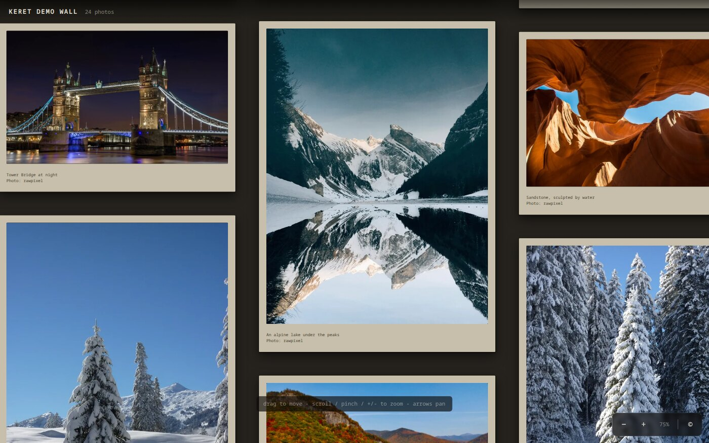

# Keret

A self-hosted photo wall. Point it at a folder of photographs and it builds a
single static page: every photo in its own frame on one big wall you pan and
zoom, laid out so nothing overlaps and nothing is cropped.

Named after the Hungarian word for *frame*. It is the engine behind
[jpg.krisztian.wtf](https://jpg.krisztian.wtf/), extracted into a tool anyone can
run.

- **Static output.** A folder of HTML, images and crawler files. No database, no
  server-side runtime, no client framework.
- **Originals are never published.** Every photo is re-encoded on the way out, so
  EXIF metadata, including GPS, is dropped and orientation is baked in.
- **One photo, one frame.** Frames keep the photo's real aspect ratio: nothing is
  cropped to fit a grid.
- **Built to survive a phone.** Pan, pinch, double-tap, fit. The engine is the
  one that was debugged on real iOS hardware after a wall of a few hundred photos
  started killing the tab.
- **No JavaScript required to read it.** Without JS you get a plain list of the
  photos; the interactive wall is an enhancement.



## Quick start

```sh
# 1. get the tool
git clone https://github.com/krisztianhadi/keret.git
cd keret
npm install                      # sharp, the only dependency

# 2. build the bundled demo wall and look at it
npm run demo
npm run demo:serve               # http://127.0.0.1:3100/
```

Building your own wall:

```sh
mkdir -p ~/pictures/wall/photos
cp ~/photos/*.jpg ~/pictures/wall/photos/
cd ~/pictures/wall
node ~/Code/keret/gen.js         # writes ./dist
npx --yes serve dist             # or any static file server
```

No config file is needed to start: the defaults build a wall from `./photos`
into `./dist`. Copy [`wall.config.example.json`](wall.config.example.json) to
`wall.config.json` when you want to change something.

## Requirements

- Node 18.17 or newer (Node 20+ recommended).
- `sharp`, installed by `npm install`. It is not optional: it is what strips
  metadata and bakes in EXIF orientation. The build refuses to run without it
  rather than publishing originals.

## Commands

| Command | What it does |
| --- | --- |
| `node gen.js` | builds `./photos` into `./dist` |
| `node gen.js --check` | lays the wall out, writes nothing |
| `node gen.js --help` | every option |
| `npm run demo` | rebuilds the bundled demo wall (`demo/dist`) |
| `npm run demo:serve` | serves the demo on port 3100 |
| `npm run demo:check` | structural check of a built wall |
| `npm run seed` | writes sample images into `./photos` |
| `npm test` | the suite (node's own runner) |

## What the wall knows about each photo

Sizes, EXIF orientation, capture date, camera and exposure are read straight from
the file headers with zero dependencies, so the layout can be computed before
anything is written and each frame matches exactly how a browser renders the
photo.

Captions are the exposure line and the camera. Both can be switched off, and a
sidecar file (`photos/captions.json`) can supply your own words per photo, which
also take over a line when a photo has no EXIF of its own:

```json
{
  "harbour-morning.jpg": {
    "title": "Harbour, first light",
    "credit": "Photo: Julia Caesar"
  }
}
```

## Configuration

Everything lives in `wall.config.json` in the directory you run the generator
from: title, description, site URL, caption rules, the geometry of the wall
(column width, gutters, mats, margins), how large the served copies are, and an
optional analytics snippet. Every key is documented in
[docs/API.md](docs/API.md#configuration); the defaults live in
[`src/config.js`](src/config.js).

Unknown keys are a hard error, so a typo fails the build instead of being
ignored.

## The demo wall

[`demo/`](demo/) is a complete wall: 24 public-domain photographs (no people),
their captions and the built site, committed so the demo builds offline and can
be served by GitHub Pages. Sources and licenses are listed in
[demo/CREDITS.md](demo/CREDITS.md).

## Privacy and safety

- `sharp` is mandatory, so published copies never carry EXIF, GPS or embedded
  thumbnails.
- The GPS IFD in the source photos is never even parsed.
- The build wipes its output directory. Before it does, it refuses to run when
  the output would be the photos folder, the project root, or a non-empty
  directory that does not look like a previous build (unless `--force`).
- A photo that cannot be published fails the build; the page is never written
  with a frame pointing at a missing file.

Details in [SECURITY.md](SECURITY.md).

## Documentation

Start at [docs/INDEX.md](docs/INDEX.md). The short version:
[SETUP.md](docs/SETUP.md) to run it, [API.md](docs/API.md) for the CLI and every
config key, [ARCHITECTURE.md](docs/ARCHITECTURE.md) for how the build and the
engine fit together.

## Built with AI

Keret is hand-written and AI-enhanced. Krisztian owns the specification, the
design decisions and the review; the code was written with **DeepSeek V4.1 Flash
in DeepSeek Harness**, under a documented method: every claim in these docs is
backed by a command in the repository, the tests are the contract, and the review
that drove the extraction from the original site is preserved in the git history
and [docs/CHANGELOG.md](docs/CHANGELOG.md) - so a reader can see which parts came
from where.

## License

MIT. See [LICENSE](LICENSE).
